# Документация проекта "C.I.R.C."

#### **Краткое описание:**  
Cистема нужна для наилучшего функционирования одного малого бизнеса - изготовления зефирных букетов цветов на заказ. Система будет представлять из себя веб сервис для конкретного человека (владельца бизнеса) для мониторинга заказов, отслеживания остатков ингредиентов.
Проект разрабатывается под одного конкретного бизнеса.

> Окно приветствия 

#### **Функциональные требования проекта:**
Учёт заказов (создание, статусы)
Управление запасами (учёт остатков - показ ингредиентов, что скоро закончатся, также показ уже закончившихся ингредиентов)

#### **Технические детали:**
Разработка ведется на ASP.NET Core, Entity Framework (Backend).
Frontend ведется на React, для БД используется Postgresql. Дизайн был построен с помощью Figma. Также будет использован Docker, собственно развернут проект будет с его помощью. Мобильное приложение не планируется, только веб.

# **Сценарии использования. Логика работы системы.**

При открытии веб приложения пользователю открывается главное меню с данными о заказах и наличии ингредиентов. В контекстном меню находятся разделы: Заказы, Клиенты, Склад, Другое, Финансы. Также есть функция выхода из системы.

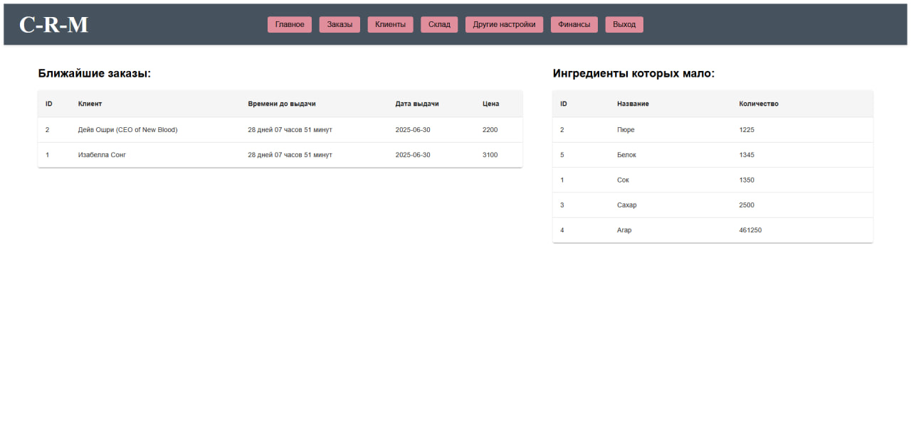

## Заказы 

Раздел заказов имеет следующий вид:

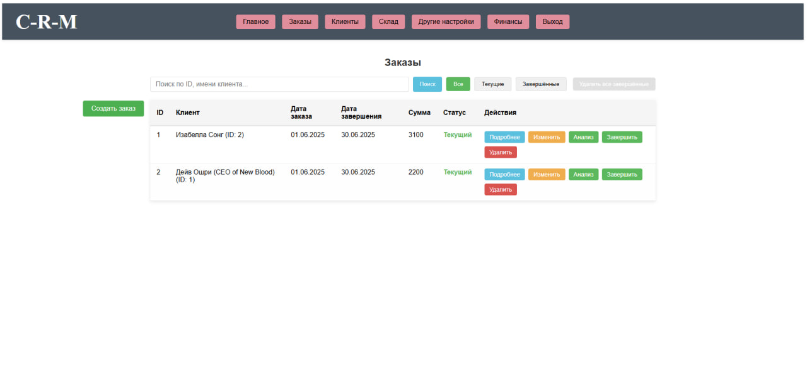

Здесь можно создать новый заказ, редактировать уже существующий или просмотреть его, а также провести анализ прибыли заказа. Остановимся, к примеру, на последнем - на скриншоте видно, как это реализовано.

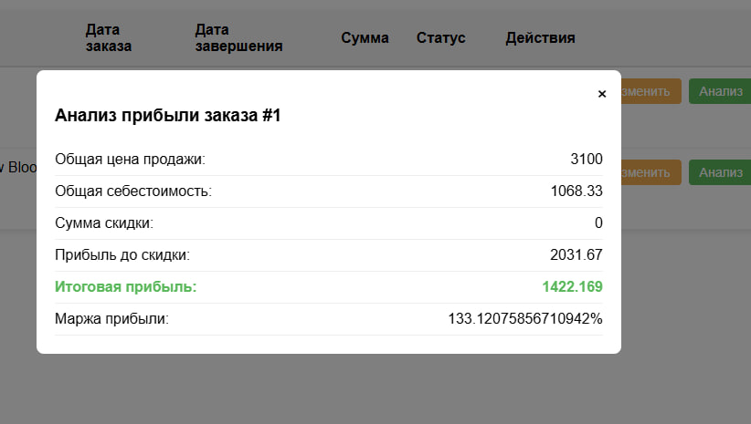

Однако, перед тем, как создать заказ, надо указать его клиента. Для внесения в базу данных клиентов существует отдельный раздел. 

## Клиенты

В нем видна вся информация о клиентах: номера телефонов, количество заказов, скидки, дата последнего заказа и общая сумма потраченных средств.

Само собой, в нем же можно и добавить нового клиента.

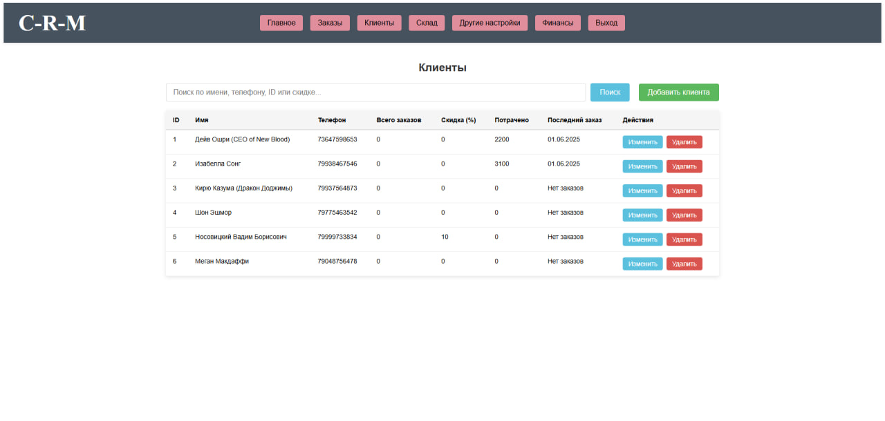

## Склад

Клиенты есть. Заказы тоже. Не хватает наполнения этих заказов - самих цветков, лотов. 
Однако, без нужных ингредиентов ничего не сделаешь. 
Добавим ингредиенты в разделе Склад -> Ингредиенты. 

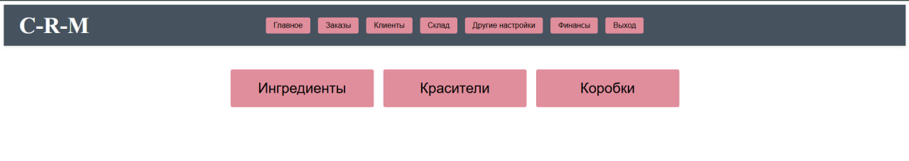

Попутно здесь можно добавить необходимые для заказа коробки и красители.

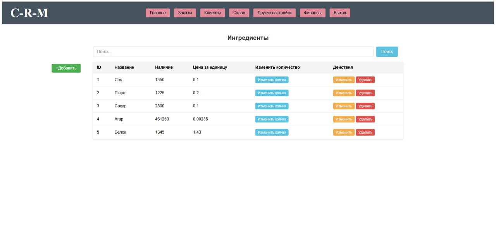

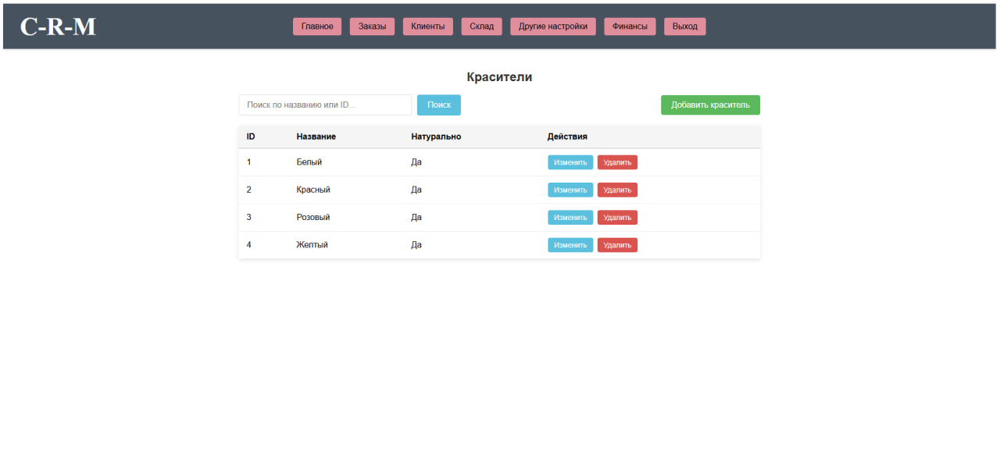

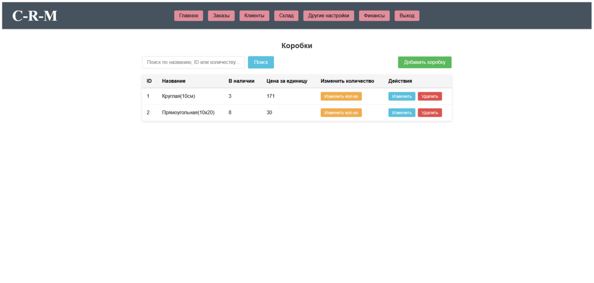

## Цветки и лоты. 

Теперь, после заданных ингредиентов, можно переходить к последней части всего процесса - созданию рецептов цветков и созданию лотов для заказов. 

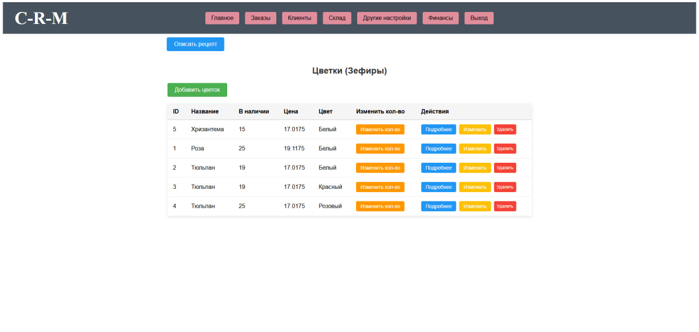

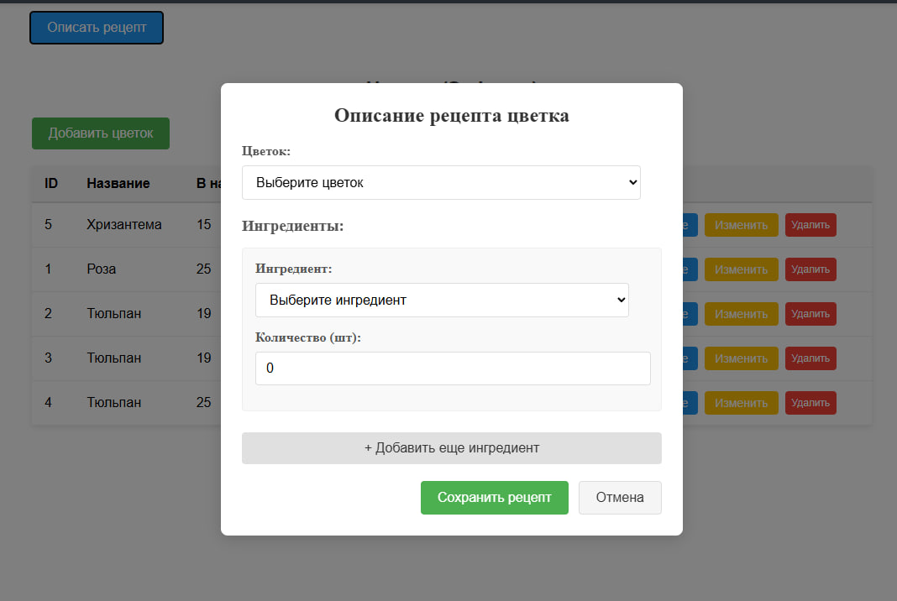

> Описание цветка

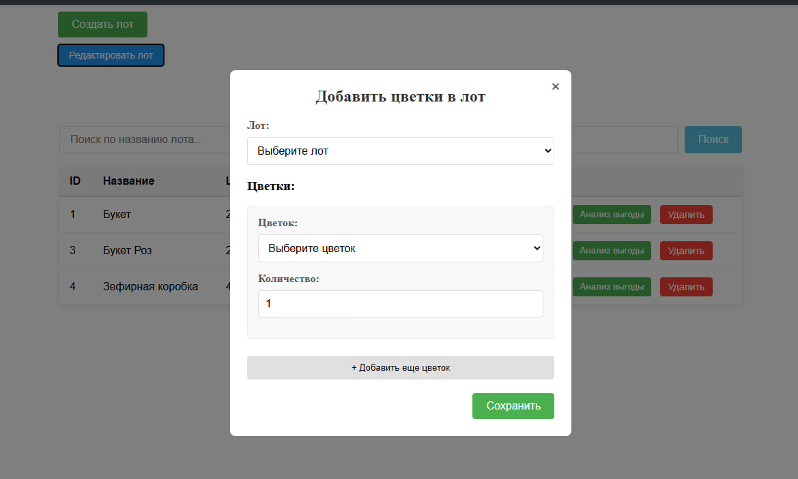

> Формирование лота

После всех этих нехитрых манипуляций можно закрыть заказ в меню "Заказы". 

## Финансы

Последний раздел, заслуживающий упоминания - раздел "Финансы". Здесь клиент может посмотреть и детально проанализировать все финансовые точности завершенных заказов.

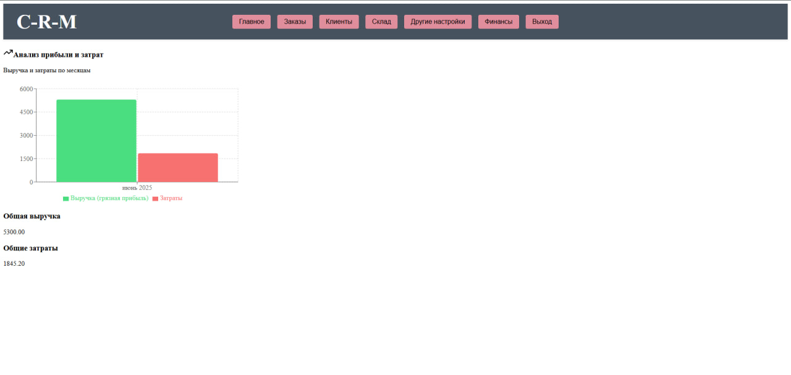
